# Deployment Guide

## ✅ Problem Solved: Smart Type Generation with Fallback

The build failure has been fixed with a robust solution that **always ensures types are available** for the build.

### How it Works

1. **Environment Variables**: Loads from `.env` file using dotenv package
2. **Existing Types**: Generated types are committed to git as fallback
3. **Smart Generation**: Tries to regenerate from API if available  
4. **Graceful Fallback**: Uses committed types if API is unavailable
5. **Build Safety**: Never fails due to missing types

## Environment Setup

### Create `.env` file

Create a `.env` file in your project root with:

```bash
# API Configuration
VITE_API_URL=http://localhost:3005
VITE_API_URL_PRODUCTION=https://your-production-api.com
VITE_NODE_MODE=development

# Auth0 Configuration  
VITE_DOMAIN=your-auth0-domain.auth0.com
VITE_CLIENT_ID=your-auth0-client-id
VITE_AUDIENCE=your-auth0-audience
```

### For Render Deployment

Use this build command (recommended):
```bash
pnpm install && pnpm run build
```

Or with explicit type checking:
```bash
pnpm install && pnpm run build:with-tsc
```

### Environment Variables in Render

Set these in your Render dashboard:

**Required for production:**
- `VITE_API_URL_PRODUCTION` - Your production API URL
- `VITE_NODE_MODE=production`
- Auth0 variables as needed

**Optional for deployment:**
- `VITE_API_URL` - Only needed if you want to regenerate types during build

### Build Process Flow

```mermaid
flowchart TD
    A[Start Build] --> B[Load .env file]
    B --> C{API URL Available?}
    C -->|Yes| D[Try Generate Types]
    C -->|No| E{Existing Types?}
    
    D --> F{Generation Success?}
    F -->|Yes| G[✅ Use New Types]
    F -->|No| H{Existing Types?}
    
    E -->|Yes| I[✅ Use Committed Types]
    E -->|No| J[❌ Build Fails]
    
    H -->|Yes| K[⚠️ Use Committed Types]
    H -->|No| L[❌ Build Fails]
    
    G --> M[Continue Build]
    I --> M
    K --> M
```



## Available Scripts

| Script | Description | Use Case |
|--------|-------------|----------|
| `pnpm run build` | **Smart build with fallback** | 🎯 **Recommended for all environments** |
| `pnpm run build:with-tsc` | Build with TypeScript checking + smart types | 🔧 **Extra safety** |
| `pnpm run build:force-types` | Build with mandatory fresh type generation | ⚡ **Development with API running** |
| `pnpm run generate:types` | Smart type generation only | 🛠️ **Development** |
| `pnpm run generate:types:force` | Force regenerate (requires API) | 🔄 **When API schema changes** |

## Developer Workflow

### When API Schema Changes
```bash
# Ensure your API is running on port 3005 and .env has VITE_API_URL, then:
pnpm run generate:types:force
git add src/client/
git commit -m "Update API types"
```

### During Development
```bash
# Normal development (uses existing types):
pnpm run dev

# Regenerate types if API is running:
pnpm run generate:types
```

### Setting up locally
```bash
# 1. Copy environment template
cp .env.example .env  # (if available)

# 2. Edit .env with your API URL (backend runs on port 3005)
echo "VITE_API_URL=http://localhost:3005" > .env

# 3. Generate types (when your API is running on port 3005)
pnpm run generate:types
```

## Troubleshooting

### ✅ "Using committed types" message
This is **normal and safe**. Your build will work correctly.

### ❌ "No API URL found in .env file"
```bash
# Add to your .env file (backend runs on port 3005):
echo "VITE_API_URL=http://localhost:3005" >> .env
```

### ❌ "No existing types available"
```bash
# Run locally with your API running on port 3005:
pnpm run generate:types:force
git add src/client/ && git commit -m "Add generated types"
git push
```

### ⚠️ Types seem outdated
```bash
# Update types when API is accessible on port 3005:
pnpm run generate:types:force
```

## Testing Type Generation

With your backend running on port 3005, you can test the type generation:

```bash
# 1. Make sure your backend is running on port 3005
# 2. Create .env file:
echo "VITE_API_URL=http://localhost:3005" > .env

# 3. Test type generation:
pnpm run generate:types
```

## Key Benefits

- ✅ **Respects .env configuration** - Uses proper environment file loading
- ✅ **Never fails builds** due to API unavailability
- ✅ **Always has types** for TypeScript compilation  
- ✅ **CI/CD friendly** - works in isolated environments
- ✅ **Developer friendly** - clear feedback and options
- ✅ **Production ready** - uses latest types when possible, falls back gracefully 